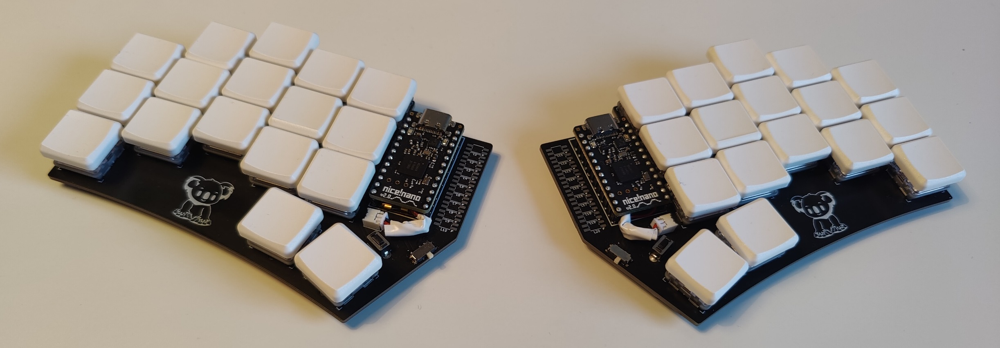

# KoalaKeeb

In this repo, I am sharing with you my ideal split keyboard, The KoalaKeeb. It is heavily inspired by the [Ferris Sweep](https://github.com/davidphilipbarr/Sweep) and borrows its physical layout. What it adds is ten SK6812 MINI-E LEDs next to the MCU that will be used to display the current battery status or bluetooth profile and a cute koala logo. I will implement the LED functionality in [my ZMK fork](https://github.com/OEberson/zmkoala) soon.

Note that the current PCB version has some imperfections that I will improve on in a second revision.

[Link to my layout](https://github.com/OEberson/zmk-config)

